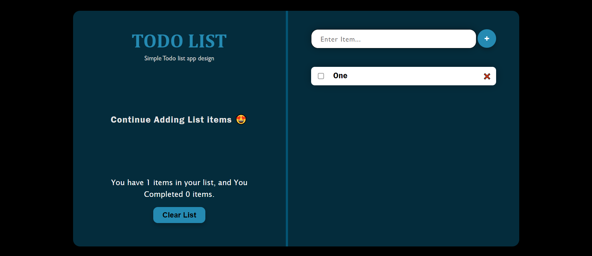

# React Todo List App.

### Live Demo: https://adilarain00.github.io/React-Todo-List-App/

### Description

This Todo List app, built with React.js Todo List app that lets users manage tasks with ease features a sleek and responsive design. With beautiful colors and a well-structured codebase, it's a perfect tool for managing daily tasks. It allows users to easily add, delete, and mark tasks as completed.

### Functionalities

It offers features like adding and deleting tasks, marking them as complete, and displays task stats on the left panel. With a modern design and structured code, it's perfect for staying organized. Crafted in React with well-structured code, the app is visually appealing and works perfectly on all devices.
